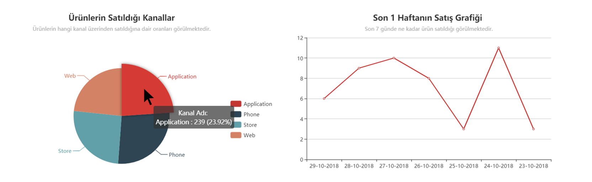

## Elasticsearch deki Verileri Echart.js ile Görselleştirme

Elasticsearch de tutulan loglar, Echarts.js ile kendi uygulamanızda nasıl görselleştirilir sorusuna yönelik bir yazı olacak. Böylece verilerinizi grafikler halinde sunduğunuzda kullanıcı ya da kendiniz için anlamlı bilgilere ulaşabilirsiniz.



+ Echarts.js ile yapılan örnekler ve örneklerin kodlarını bulmak için [link 1](http://echarts.baidu.com/echarts2/doc/example-en.html) ve [link 2](https://ecomfe.github.io/echarts-examples/public/index.html) ye bakabilirsiniz. 
+ Echarts.js, [dokümantasyonuna](https://ecomfe.github.io/echarts-doc/public/en/api.html#echarts) ulaşmak için linke tıklayabilirsiz.

**Adım 1: package.json** 

npm üzerinden `elasticsearch` (bu paket ile elasticsearch'e istemci olunur) ve `echarts`'ın paketleri indirilir. 

```
npm i elasticsearch
npm i echarts
```

**Adım 2: index.html** 

```
<!DOCTYPE html>
<html lang="en">
<head>
    <meta charset="UTF-8">
    <meta name="viewport" content="width=device-width, initial-scale=1.0">
    <meta http-equiv="X-UA-Compatible" content="ie=edge">
</head>
<body>
    <table>
        <tr>
            <th>
                <div id="pieChart" style="width:700px; height:400px;"></div>
            </th>
            <th>
                <div id="lineChart" style="width:700px; height:400px;"></div>
            </th>
        </tr>
    </table>
    <script src="underscore.min.js"></script>
    <script src="index.bundle.js"></script>
</body>
</html>
```

**Adım 3: index.js** 

```javascript
var elasticsearch = require('elasticsearch');
var echarts = require('echarts');

// burada es sunucusuna istemci olunur
var client = new elasticsearch.Client({
  host: 'http://localhost:9200',
  // es sunucusuna gönderilen istek ve cevabın konsolda görülür
  // 'trace' yerine 'error' yazıldığında istek ya da cevapta bir hata olduğunda konsolda ilgili hata görüntülenir
  log: 'error'
});

var phone, store, app, web;

// es, sunucusuna ping göndererek etkin olup olmadığına bakılır
client.ping({
  requestTimeout: 30000,
}, function (error) {
  if (error) {
    console.error('elasticsearch etkin değil');
  } else {
    console.log('Herşey yolunda');
  }
});

// pie chart için search api 
client.search({
  index: 'mockdata',
  type: '_doc',
  body: {
    "size": 0,
    "aggs": {
      "queryName": {
        "terms": {
          "field": "sales_channel.keyword",
          "order": {
            "_term": "asc"
          }
        }
      }
    }
  }
}).then(resp => {
  var result = resp.aggregations.queryName.buckets;

  app = result[0].doc_count;
  phone = result[1].doc_count;
  store = result[2].doc_count;
  web = result[3].doc_count;

  console.log(app + " " + phone + " " + store + " " + web);

  var myChart = echarts.init(document.getElementById('pieChart'));
  //grafiğin özellikleri ayarlanır
  var chartOption = {
    title: {
      text: 'Ürünlerin Satıldığı Kanallar',
      subtext: 'Ürünlerin hangi kanal üzerinden satıldığına dair oranları görülmektedir.',
      x: 'center'
    },
    tooltip: {
      trigger: 'item',
      formatter: "{a} <br/>{b} : {c} ({d}%)"
    },
    legend: {
      orient: 'vertical',
      right: 'right',
      top: '50%',
      data: ['Application', 'Phone', 'Store', 'Web']
    },
    series: [
      {
        name: 'Kanal Adı:',
        type: 'pie',
        radius: '55%',
        center: ['50%', '60%'],
        data: [
          { value: app, name: 'Application' },
          { value: phone, name: 'Phone' },
          { value: store, name: 'Store' },
          { value: web, name: 'Web' }
        ],
        itemStyle: {
          emphasis: {
            shadowBlur: 10,
            shadowOffsetX: 0,
            shadowColor: 'rgba(0, 0, 0, 0.5)'
          }
        }
      }
    ]
  };

  myChart.setOption(chartOption);

}, function (error) {
  console.trace(error.message)
});

var dateInfo = [];
var totalSales = [];

// line chart için search api 
client.search({
  index: 'mockdata',
  type: '_doc',
  body: {
    "size": 0,
    "aggs": {
      "dateRangeSearch": {
        "date_range": {
          "field": "purchased_at",
          "ranges": [
            {
              "from": "now-6d",
              "to": "now"
            }
          ]
        },
        "aggs": {
          "dateHistogramSearch": {
            "date_histogram": {
              "field": "purchased_at",
              "interval": "day",
              "order": {
                "_key": "desc"
              },
              "format": "dd-MM-yyyy"

            }
          }
        }
      }
    }
  }
}).then(resp => {
  var lineResult = resp.aggregations.dateRangeSearch.buckets[0].dateHistogramSearch.buckets;

  // for (var i = 0; i < resp.aggregations.dateRangeSearch.buckets[0].dateHistogramSearch.buckets.length; i++) {
  //   dateInfo = lineResult[i].key;
  //   totalSales = lineResult[i].doc_count;

  //   console.log("dateInfo " + dateInfo[i] + " totalSales " + totalSales[i]);
  // }

  dateInfo = [lineResult[0].key_as_string, lineResult[1].key_as_string, lineResult[2].key_as_string, lineResult[3].key_as_string, lineResult[4].key_as_string, lineResult[5].key_as_string, lineResult[6].key_as_string]
  totalSales = [lineResult[0].doc_count, lineResult[1].doc_count, lineResult[2].doc_count, lineResult[3].doc_count, lineResult[4].doc_count, lineResult[5].doc_count, lineResult[6].doc_count]


  console.log(lineResult.length);
  console.log(dateInfo);
  console.log(totalSales);

  var myLineChart = echarts.init(document.getElementById('lineChart'));

  // grafiğin özellikleri ayarlanır
  var lineChartOption = {
    title: {
      text: 'Son 1 Haftanın Satış Grafiği ',
      subtext: 'Son 7 günde ne kadar ürün satıldığı görülmektedir.',
      x: 'center'
    },
    tooltip: {
      trigger: 'item',
      formatter: "{a} <br/>{b} : {c} ({d}%)"
    },
    xAxis: {
      type: 'category',
      data: dateInfo
    },
    yAxis: {
      type: 'value'
    },
    series: [{
      data: totalSales,
      type: 'line'
    }]
  };

  myLineChart.setOption(lineChartOption);
}, function (error) {
  console.trace(error.message)
});

```


#### **Kodu güzelleştirmek için kullanılan diğer paketler;**
+ **Browserify -** Browserify, js dosyasını tarayıcının anlayabileceği bir js dosyasına dönüştürür. Yaptığınız ekranda birden fazla grafik var ve tüm grafikleri bir js dosyası üzerinden html ile eşleştirdiyseniz, browserify paketini kullanarak, tüm js dosyalarını bir bundle altında toplayabilirsiniz.

+ **Watchify -** Terminal üzerinde sürekli bundle oluşturmak yerine Watchify paketi ile js dosyasızı kaydettiğinizde değişiklikler otomatik uygulanır.

+ **babel-minify -** Js dosyanızın boyutunu indirmek isterseniz babel-minify paketini kullanabilirsiniz.

package.json dosyası üzerinden kullanımı;
```json
...
"scripts": {
    "script": "npx index.js -o index.bundle.js",
    "watch": "npx watchify index.js -o index.bundle.js",
}
...
```
